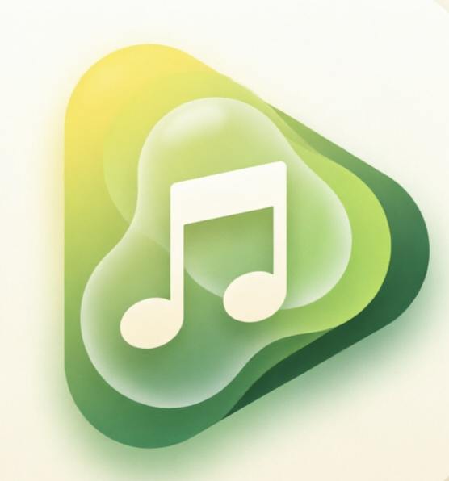
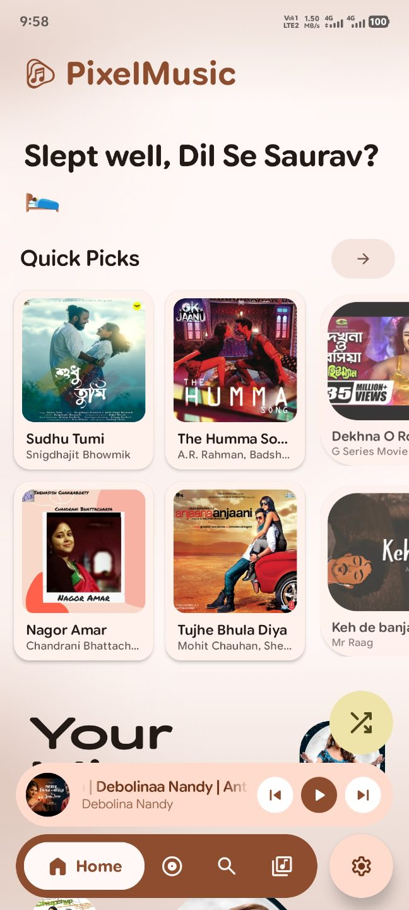
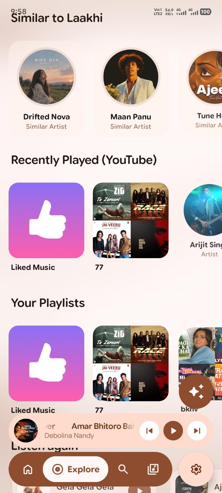
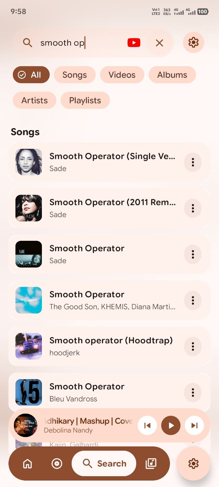
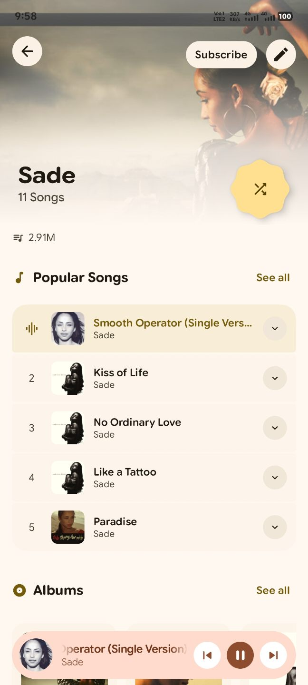
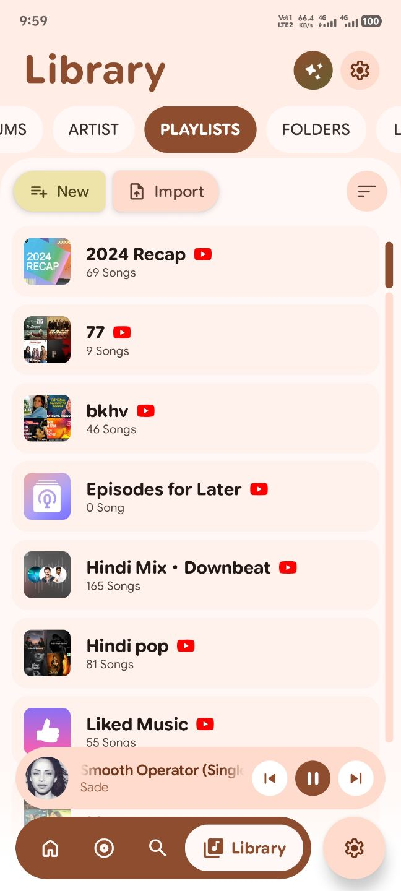
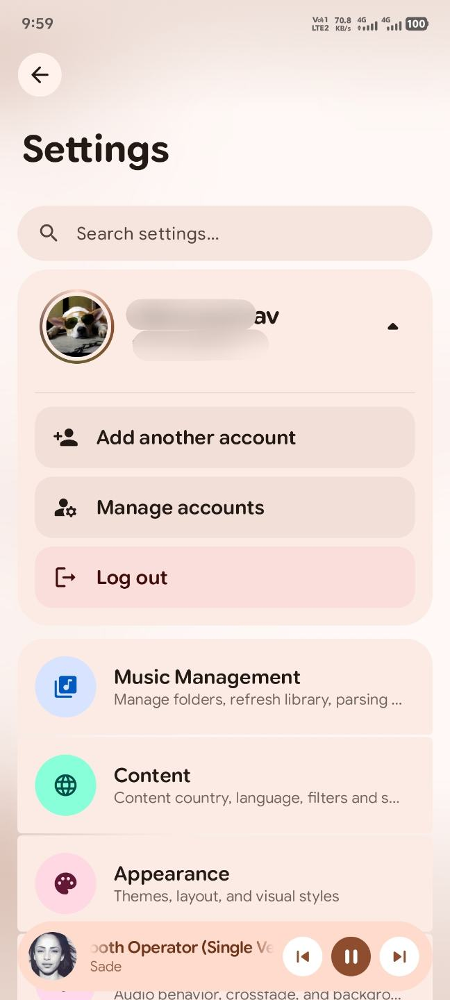
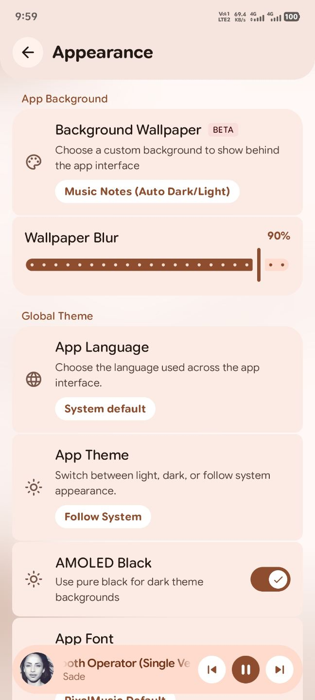
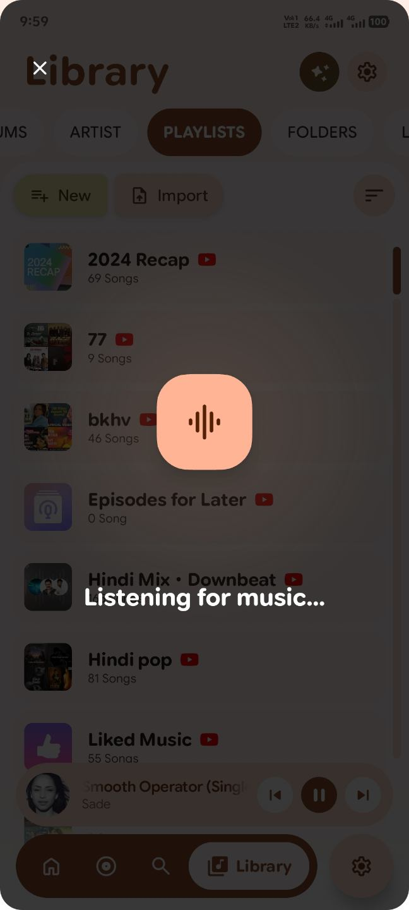
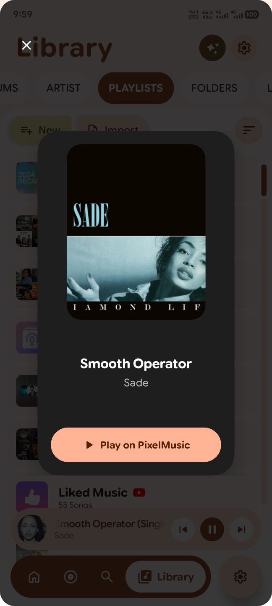

# 🎵 PixelMusic

  

  <strong>An elegant, powerful, and open-source music player designed with Material 3 Expressive aesthetics.</strong>

  <em>High-performance direct streaming, offline caching, rich embedded metadata, synchronized lyrics, and seamless cloud integrations.</em>

  
  
  
  
  

---

## 📱 App Showcase

  
  &nbsp;
  
  &nbsp;
  

  
  &nbsp;
  
  &nbsp;
  

  
  &nbsp;
  
  &nbsp;
  

---

## ✨ Features & Highlights

### ⚡ High-Performance Audio & Direct Streaming
- **Direct CDN Streaming Engine:** Audio streams resolve directly to high-speed, unencrypted GoogleVideo CDN endpoints (Opus up to 160 kbps and AAC/M4A), bypassing YouTube tracking and eliminating HTTP 403 errors.
- **Dynamic Adaptive Bitrate:** Automatically switches between optimal quality profiles based on network conditions (Wi-Fi vs. Cellular data).
- **DualPlayer Architecture & Intelligent Preloading:** Dual-engine architecture with smart queue pre-buffering delivers instantaneous playback start times and zero gap between songs.
- **Accurate Audio Telemetry:** Live `itag` bitrate resolution and sample frequency indicator (e.g., 160 kbps OPUS, 128 kbps AAC).
- **Audio Tuning & Personalization:** Built-in equalizer support, seamless crossfade, ReplayGain volume normalization, and customizable transition curves.

### 🎨 Material 3 Expressive UI & Modern Design
- **Adaptive Ambient Theming:** Fully integrated with Material You dynamic color palettes that harmonize with your album artwork and wallpaper.
- **Dynamic Ambient Profile Ring:** Profile avatar with flowing sweep gradient ring that reacts to system themes.
- **Fluid AGSL Animations & Shaders:** Smooth, high-performance visual animations, fog scrim headers, and Android 13+ motion blur.
- **Customizable Layouts:** Configurable navigation bar corner radii, collapsible headers, and haptic feedback gestures.

### 🎤 Synchronized Lyrics & AI Rescue
- **Time-Synced Lyrics:** Real-time scrolling lyrics with karaoke-style highlights and `.lrc` format compatibility.
- **Immersive Modes:** View full-screen typography and artist backgrounds in Immersive and Immersive Extended Now Playing modes.
- **🤖 AI Lyrics Rescue (Beta):** Fallback AI generation powered by Gemini / custom AI providers when standard lyric sources are unavailable.
- **Smart Matching Engine:** Sanitizes and normalizes track titles (removing remix tags, feature markers, and bracketed noise) to maximize lyric match rates.

### 💾 High-Speed Downloader & Embedded Metadata
- **Multi-Provider Parallel Chunk Downloader:** Multi-threaded parallel downloading with byte-level range resumption to prevent timeouts on large downloads.
- **Embedded ID3 & MP4 Metadata:** Automatically embeds complete song metadata (Title, Artist, Album, Album Artist, Year, Track Number, Genre, and High-Resolution Album Art) via TagLib and JAudioTagger.
- **Embedded Synchronized Lyrics:** Saves timestamped `.lrc` directly inside audio files for offline playback in any music player.
- **Android MediaStore Sync:** Downloaded tracks immediately register in the system media store.

### ☁️ Cloud & Self-Hosted Music Servers
- **Subsonic API Compatibility:** Connect to Navidrome, Airsonic, and all Subsonic-compliant music servers.
- **Jellyfin Integration:** Stream directly from your self-hosted Jellyfin media libraries.
- **Streaming Platforms:** Sync playlists and favorites from NetEase Music, QQ Music, and YouTube Music.

### 🏝️ System & OEM Integrations
- **Dynamic Island / Capsule Integration:** Native status bar capsule support for OriginOS, HyperOS, Realme UI, OxygenOS, and ColorOS for live playback tracking.
- **Ambient Music Recognition:** Quick Settings Tile and dedicated overlay task with haptic feedback to identify music playing around you.
- **Android Auto & Automotive Controls:** Complete dashboard integration for safe in-car playback.
- **Glance App Widgets:** Modern Material 3 home screen widgets for instant controls and track information.
- **Share as 30s Video:** Generate and export a 30-second animated video card with album artwork to share on social media.

### 🛡️ Library Management & Safeguards
- **Accidental Deletion Protections:** Confirmation safeguards for deleting custom playlists and removing tracks.
- **Direct YouTube Sync:** Add or remove songs directly from the Song Info bottom sheet with bi-directional YouTube cloud sync.
- **Full Backup & Restore:** Securely backup your library, playlists, settings, and session cookies for seamless migration.

### 🔄 In-App Updater
- **Semantic Versioning (SemVer):** Strict 3-part version comparison prevents improper downgrade prompts.
- **Resilient Resume:** HTTP 206 Partial Content verification protects APK downloads from corruption.
- **In-App Changelog Viewer:** Preview updates with formatted release notes and direct installer launching.

---

## 🛠️ Tech Stack & Architecture

- **Language:** 100% [Kotlin](https://kotlinlang.org/)
- **UI Framework:** [Jetpack Compose](https://developer.android.com/jetpack/compose) with Material 3 Expressive
- **Media Playback:** [AndroidX Media3](https://developer.android.com/media/media3) (ExoPlayer, Session, Transformer)
- **Dependency Injection:** [Dagger Hilt](https://dagger.dev/hilt/)
- **Local Storage:** [AndroidX Room](https://developer.android.com/training/data-storage/room) & DataStore Preferences
- **Networking:** [OkHttp](https://square.github.io/okhttp/), [Ktor Client](https://ktor.io/), [Retrofit](https://square.github.io/retrofit/)
- **Tagging & Audio Processing:** [TagLib](https://taglib.org/), [JAudioTagger](http://www.jthink.net/jaudiotagger/), VorbisJava
- **Image Loading:** [Coil 3](https://coil-kt.github.io/coil/)
- **Audio Extraction:** NewPipe Extractor

---

## 📥 Getting Started

### Prerequisites
- Android 11.0 (API Level 30) or higher.

### Installation
1. Head over to the **[Releases](https://github.com/Saurav-02/PixelMusic/releases)** page.
2. Download the latest `PixelMusic-vX.X.X.apk`.
3. Install the APK on your Android device (ensure "Install from Unknown Sources" is enabled).

> ⚠️ **Notice regarding Application ID:**  
> The application ID is `com.saurav.pixelmusic`. If upgrading from older forks or packages, please create a backup via **Settings > Backup and restore > Backup all data**, copy your session cookies, install the update, and restore your data.

---

## ℹ️ About Section

| Metric | Details |
|---|---|
| **App Name** | **PixelMusic** |
| **Tagline** | *Open source music player built with its community.* |
| **Philosophy** | Open source • Community-first • Material 3 Expressive |
| **Main Developer** | **Saurav Biswas** ([@Saurav124x](https://t.me/Saurav124x) • [@holy_saurav](https://www.instagram.com/holy_saurav) • [GitHub](https://github.com/Saurav-02)) |
| **UI Collaborator** | **@Xyg901** ([Telegram](https://t.me/Xyg901)) |
| **Credits & Attribution** | Built upon and inspired by the open-source **PixelPlayer** project created by Theo Vilardo. |

### 💬 Community & Support
- **Telegram:** Connect with the developers and community on Telegram:
  - Main Developer: [@Saurav124x](https://t.me/Saurav124x)
  - UI Makeover: [@Xyg901](https://t.me/Xyg901)
- **Instagram:** [@holy_saurav](https://www.instagram.com/holy_saurav)
- **Bug Reports & Feedback:** Please open an issue on the [GitHub Issues](https://github.com/Saurav-02/PixelMusic/issues) page.

---

## 📄 License & Disclaimer

PixelMusic is an open-source project developed for educational and personal use. All music, artwork, and streaming content remain the copyright and property of their respective creators and service providers.
