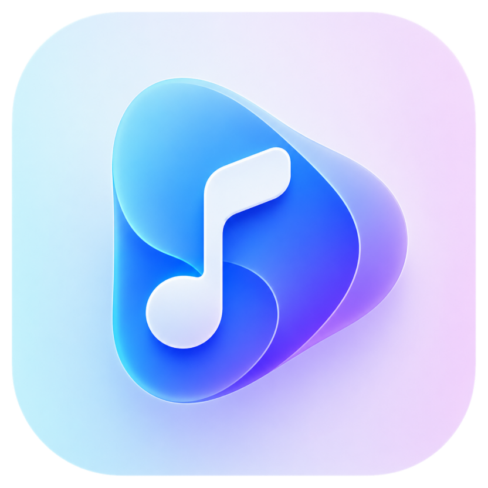
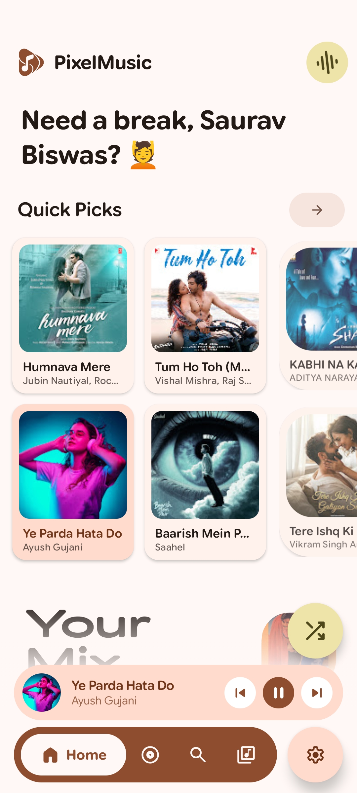
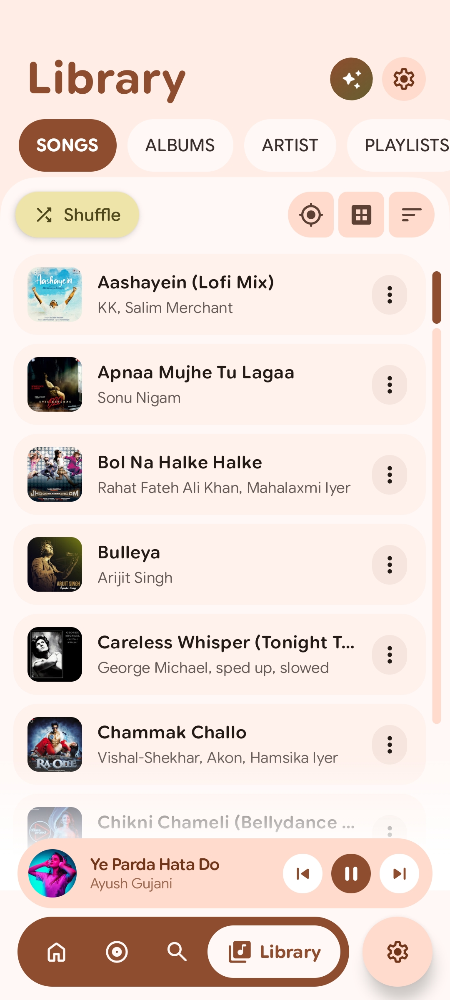
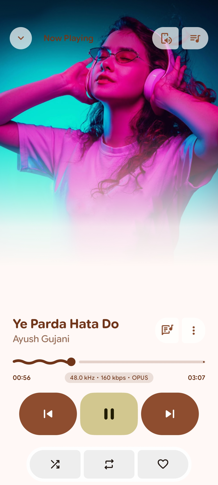
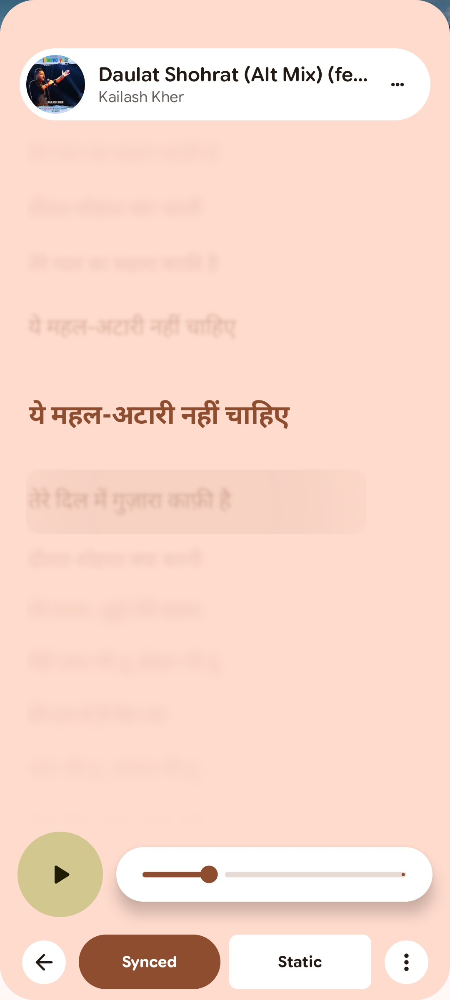
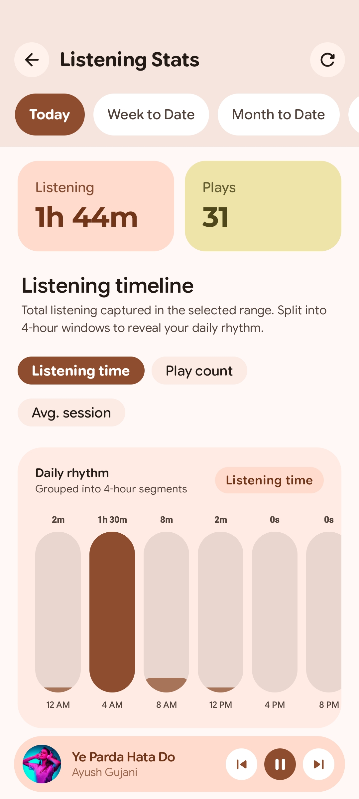
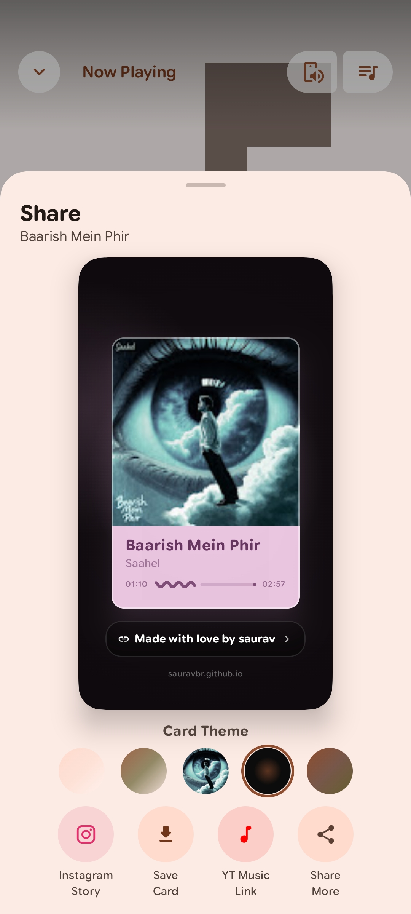
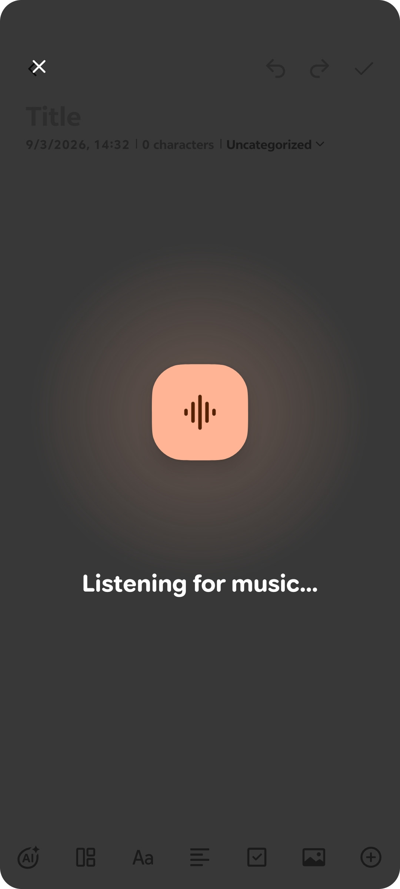
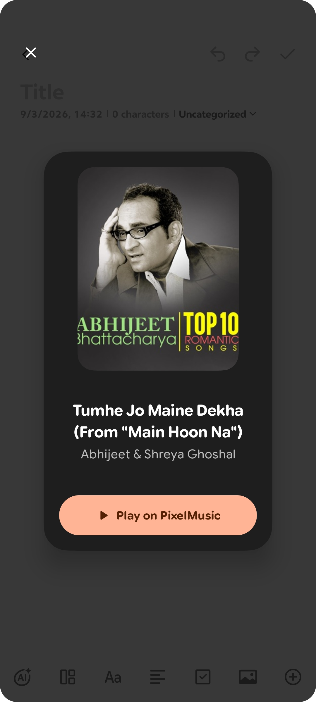
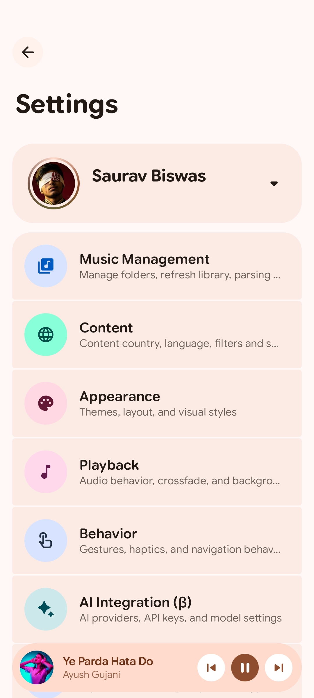

# PixelMusic 🎶

  

  <strong>The Ultimate Hybrid Local & Streaming Music Powerhouse for Android</strong>  
  An elegant, feature-rich audio experience built for audiophiles and streaming enthusiasts, featuring Material You expressive support. 

<!-- This creates the seamless 3-column grid -->

  
  
   
  
  
   
  
  
   
  
  
   
  

  
  
  

---

## 📖 What is PixelMusic?

**PixelMusic** is a beautiful, unified audio player for Android. It seamlessly bridges your offline local library with streaming catalogs under a single, fluid interface powered by Material You. 

## ⚡ Feature Highlights

| Feature | Description |
|:---|:---|
| **Dynamic Island Support** | Native support for OriginOS Capsule and Android 16 Live Updates. See live playback progress directly in your status bar! |
| **Hybrid Streaming** | Stream from YouTube Music, Telegram channels, Google Drive, or play your local offline files seamlessly. |
| **Music Recognition** | Built-in audio recognition to identify playing songs instantly, complete with a slick animated UI. |
| **Material You Design** | The entire app adapts dynamically to the colors of your currently playing album artwork. |
| **Synchronized Lyrics** | Real-time synchronized LRC lyrics for your favorite tracks. |
| **Interactive Widgets** | Beautiful Android Glance home-screen widgets with playback controls and artwork displays. |
| **Shareable Cards** | Generate gorgeous, glassmorphism-style share cards for your favorite songs to post on stories. |

---

## 💻 Source Code & Contributing

PixelMusic is an open, community-driven effort! 

* **Get the Source Code:** The complete source code is 100% free! Just reach out to the developer directly on Telegram ([@Saurav124x](https://t.me/Saurav124x)), and it will be happily provided to you.
* **Contribute & Modify:** You are highly encouraged to modify the app, add new features, fix bugs, or tweak the UI. Contributions, custom features, and forks are always welcome to make the app even better!

---

  <a href="https://t.me/Saurav124x">Contact Developer</a> •
  <a href="../../releases">Download Releases</a>

